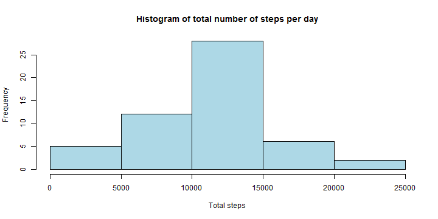
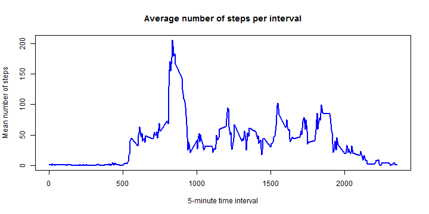
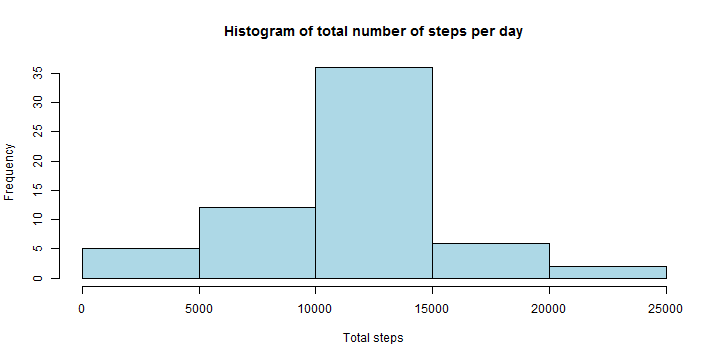
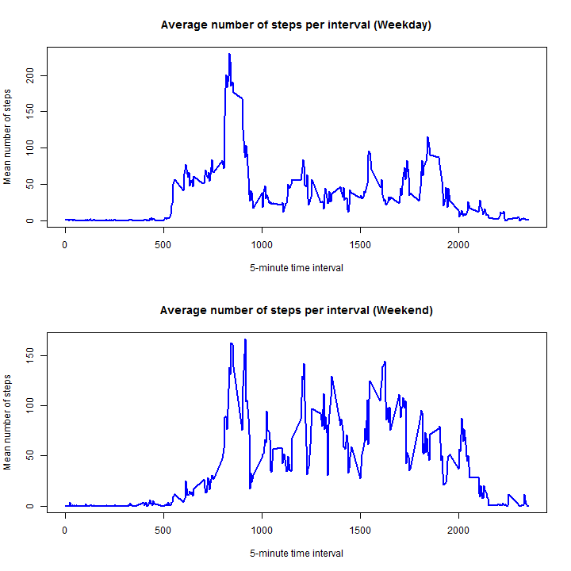

# Reproducible Research: Peer Assessment 1
## author: Matthew A. Lanham


The dataset description:
- The dataset is stored in a comma-separated-value (CSV) file and there are a total of 17,568 observations in this dataset.
1. steps: Number of steps taking in a 5-minute interval (missing values are coded as NA)
2. date: The date on which the measurement was taken in YYYY-MM-DD format
3. interval: Identifier for the 5-minute interval in which measurement was taken


```r
## Loading and preprocessing the data
data = read.csv("activity\\activity.csv")
head(data)
```

```
##   steps       date interval
## 1    NA 2012-10-01        0
## 2    NA 2012-10-01        5
## 3    NA 2012-10-01       10
## 4    NA 2012-10-01       15
## 5    NA 2012-10-01       20
## 6    NA 2012-10-01       25
```

## What is mean total number of steps taken per day?

```r
## Create a new data set calculating the total, mean, and median steps per day
my_dates = as.data.frame(table(data$date))[,1]
data2 = data
data2$date = as.ordered(data2$date)
listOfSums = by(data2[,c("steps","interval")], data2$date, colSums)
listOfMeans = by(data2[,c("steps","interval")], data2$date, colMeans)
require(miscTools) #needed for colMedians() function
listOfMedians = by(data2[,c("steps","interval")], data2$date, colMedians)
summaryByDay = as.data.frame(matrix(nrow=length(my_dates), ncol=4))
colnames(summaryByDay) = c("date","total","mean","median")
for (i in 1:length(my_dates)) {
    summaryByDay[i,1] = as.character(my_dates[i])          #date
    summaryByDay[i,2] = listOfSums[[my_dates[i]]][[1]]     #total
    summaryByDay[i,3] = listOfMeans[[my_dates[i]]][[1]]    #mean
    summaryByDay[i,4] = listOfMedians[[my_dates[i]]][[1]]  #median
}

## Create a Histogram
hist(summaryByDay[,2], col="lightblue"
     , main="Histogram of total number of steps per day"
     , xlab="Total steps"
     , ylab="Frequency")
```

 

```r
## Report of mean and median total number of steps by day (ignore missing values)
summaryByDay[complete.cases(summaryByDay),c("date","mean","median")]
```

```
##          date       mean median
## 2  2012-10-02  0.4375000      0
## 3  2012-10-03 39.4166667      0
## 4  2012-10-04 42.0694444      0
## 5  2012-10-05 46.1597222      0
## 6  2012-10-06 53.5416667      0
## 7  2012-10-07 38.2465278      0
## 9  2012-10-09 44.4826389      0
## 10 2012-10-10 34.3750000      0
## 11 2012-10-11 35.7777778      0
## 12 2012-10-12 60.3541667      0
## 13 2012-10-13 43.1458333      0
## 14 2012-10-14 52.4236111      0
## 15 2012-10-15 35.2048611      0
## 16 2012-10-16 52.3750000      0
## 17 2012-10-17 46.7083333      0
## 18 2012-10-18 34.9166667      0
## 19 2012-10-19 41.0729167      0
## 20 2012-10-20 36.0937500      0
## 21 2012-10-21 30.6284722      0
## 22 2012-10-22 46.7361111      0
## 23 2012-10-23 30.9652778      0
## 24 2012-10-24 29.0104167      0
## 25 2012-10-25  8.6527778      0
## 26 2012-10-26 23.5347222      0
## 27 2012-10-27 35.1354167      0
## 28 2012-10-28 39.7847222      0
## 29 2012-10-29 17.4236111      0
## 30 2012-10-30 34.0937500      0
## 31 2012-10-31 53.5208333      0
## 33 2012-11-02 36.8055556      0
## 34 2012-11-03 36.7048611      0
## 36 2012-11-05 36.2465278      0
## 37 2012-11-06 28.9375000      0
## 38 2012-11-07 44.7326389      0
## 39 2012-11-08 11.1770833      0
## 42 2012-11-11 43.7777778      0
## 43 2012-11-12 37.3784722      0
## 44 2012-11-13 25.4722222      0
## 46 2012-11-15  0.1423611      0
## 47 2012-11-16 18.8923611      0
## 48 2012-11-17 49.7881944      0
## 49 2012-11-18 52.4652778      0
## 50 2012-11-19 30.6979167      0
## 51 2012-11-20 15.5277778      0
## 52 2012-11-21 44.3993056      0
## 53 2012-11-22 70.9270833      0
## 54 2012-11-23 73.5902778      0
## 55 2012-11-24 50.2708333      0
## 56 2012-11-25 41.0902778      0
## 57 2012-11-26 38.7569444      0
## 58 2012-11-27 47.3819444      0
## 59 2012-11-28 35.3576389      0
## 60 2012-11-29 24.4687500      0
```

## What is the average daily activity pattern?

```r
## Create a dataset showing the mean per interval for the time-series plot
my_intervals = as.data.frame(table(data$interval))[,1]
data3 = data
data3$interval = as.ordered(data3$interval)
data3$date = as.numeric(data3$date)
listOfIntervalMeans = by(data3[,c("steps","date")], data3$interval, colMeans, na.rm=TRUE)
summaryByInterval = as.data.frame(matrix(nrow=length(my_intervals), ncol=2))
colnames(summaryByInterval) = c("interval","mean")
for (i in 1:length(my_intervals)) {
    summaryByInterval[i,1] = as.character(my_intervals[i])                #interval
    summaryByInterval[i,2] = listOfIntervalMeans[[my_intervals[i]]][[1]]  #mean
}
summaryByInterval
```

```
##     interval        mean
## 1          0   1.7169811
## 2          5   0.3396226
## 3         10   0.1320755
## 4         15   0.1509434
## 5         20   0.0754717
## 6         25   2.0943396
## 7         30   0.5283019
## 8         35   0.8679245
## 9         40   0.0000000
## 10        45   1.4716981
## 11        50   0.3018868
## 12        55   0.1320755
## 13       100   0.3207547
## 14       105   0.6792453
## 15       110   0.1509434
## 16       115   0.3396226
## 17       120   0.0000000
## 18       125   1.1132075
## 19       130   1.8301887
## 20       135   0.1698113
## 21       140   0.1698113
## 22       145   0.3773585
## 23       150   0.2641509
## 24       155   0.0000000
## 25       200   0.0000000
## 26       205   0.0000000
## 27       210   1.1320755
## 28       215   0.0000000
## 29       220   0.0000000
## 30       225   0.1320755
## 31       230   0.0000000
## 32       235   0.2264151
## 33       240   0.0000000
## 34       245   0.0000000
## 35       250   1.5471698
## 36       255   0.9433962
## 37       300   0.0000000
## 38       305   0.0000000
## 39       310   0.0000000
## 40       315   0.0000000
## 41       320   0.2075472
## 42       325   0.6226415
## 43       330   1.6226415
## 44       335   0.5849057
## 45       340   0.4905660
## 46       345   0.0754717
## 47       350   0.0000000
## 48       355   0.0000000
## 49       400   1.1886792
## 50       405   0.9433962
## 51       410   2.5660377
## 52       415   0.0000000
## 53       420   0.3396226
## 54       425   0.3584906
## 55       430   4.1132075
## 56       435   0.6603774
## 57       440   3.4905660
## 58       445   0.8301887
## 59       450   3.1132075
## 60       455   1.1132075
## 61       500   0.0000000
## 62       505   1.5660377
## 63       510   3.0000000
## 64       515   2.2452830
## 65       520   3.3207547
## 66       525   2.9622642
## 67       530   2.0943396
## 68       535   6.0566038
## 69       540  16.0188679
## 70       545  18.3396226
## 71       550  39.4528302
## 72       555  44.4905660
## 73       600  31.4905660
## 74       605  49.2641509
## 75       610  53.7735849
## 76       615  63.4528302
## 77       620  49.9622642
## 78       625  47.0754717
## 79       630  52.1509434
## 80       635  39.3396226
## 81       640  44.0188679
## 82       645  44.1698113
## 83       650  37.3584906
## 84       655  49.0377358
## 85       700  43.8113208
## 86       705  44.3773585
## 87       710  50.5094340
## 88       715  54.5094340
## 89       720  49.9245283
## 90       725  50.9811321
## 91       730  55.6792453
## 92       735  44.3207547
## 93       740  52.2641509
## 94       745  69.5471698
## 95       750  57.8490566
## 96       755  56.1509434
## 97       800  73.3773585
## 98       805  68.2075472
## 99       810 129.4339623
## 100      815 157.5283019
## 101      820 171.1509434
## 102      825 155.3962264
## 103      830 177.3018868
## 104      835 206.1698113
## 105      840 195.9245283
## 106      845 179.5660377
## 107      850 183.3962264
## 108      855 167.0188679
## 109      900 143.4528302
## 110      905 124.0377358
## 111      910 109.1132075
## 112      915 108.1132075
## 113      920 103.7169811
## 114      925  95.9622642
## 115      930  66.2075472
## 116      935  45.2264151
## 117      940  24.7924528
## 118      945  38.7547170
## 119      950  34.9811321
## 120      955  21.0566038
## 121     1000  40.5660377
## 122     1005  26.9811321
## 123     1010  42.4150943
## 124     1015  52.6603774
## 125     1020  38.9245283
## 126     1025  50.7924528
## 127     1030  44.2830189
## 128     1035  37.4150943
## 129     1040  34.6981132
## 130     1045  28.3396226
## 131     1050  25.0943396
## 132     1055  31.9433962
## 133     1100  31.3584906
## 134     1105  29.6792453
## 135     1110  21.3207547
## 136     1115  25.5471698
## 137     1120  28.3773585
## 138     1125  26.4716981
## 139     1130  33.4339623
## 140     1135  49.9811321
## 141     1140  42.0377358
## 142     1145  44.6037736
## 143     1150  46.0377358
## 144     1155  59.1886792
## 145     1200  63.8679245
## 146     1205  87.6981132
## 147     1210  94.8490566
## 148     1215  92.7735849
## 149     1220  63.3962264
## 150     1225  50.1698113
## 151     1230  54.4716981
## 152     1235  32.4150943
## 153     1240  26.5283019
## 154     1245  37.7358491
## 155     1250  45.0566038
## 156     1255  67.2830189
## 157     1300  42.3396226
## 158     1305  39.8867925
## 159     1310  43.2641509
## 160     1315  40.9811321
## 161     1320  46.2452830
## 162     1325  56.4339623
## 163     1330  42.7547170
## 164     1335  25.1320755
## 165     1340  39.9622642
## 166     1345  53.5471698
## 167     1350  47.3207547
## 168     1355  60.8113208
## 169     1400  55.7547170
## 170     1405  51.9622642
## 171     1410  43.5849057
## 172     1415  48.6981132
## 173     1420  35.4716981
## 174     1425  37.5471698
## 175     1430  41.8490566
## 176     1435  27.5094340
## 177     1440  17.1132075
## 178     1445  26.0754717
## 179     1450  43.6226415
## 180     1455  43.7735849
## 181     1500  30.0188679
## 182     1505  36.0754717
## 183     1510  35.4905660
## 184     1515  38.8490566
## 185     1520  45.9622642
## 186     1525  47.7547170
## 187     1530  48.1320755
## 188     1535  65.3207547
## 189     1540  82.9056604
## 190     1545  98.6603774
## 191     1550 102.1132075
## 192     1555  83.9622642
## 193     1600  62.1320755
## 194     1605  64.1320755
## 195     1610  74.5471698
## 196     1615  63.1698113
## 197     1620  56.9056604
## 198     1625  59.7735849
## 199     1630  43.8679245
## 200     1635  38.5660377
## 201     1640  44.6603774
## 202     1645  45.4528302
## 203     1650  46.2075472
## 204     1655  43.6792453
## 205     1700  46.6226415
## 206     1705  56.3018868
## 207     1710  50.7169811
## 208     1715  61.2264151
## 209     1720  72.7169811
## 210     1725  78.9433962
## 211     1730  68.9433962
## 212     1735  59.6603774
## 213     1740  75.0943396
## 214     1745  56.5094340
## 215     1750  34.7735849
## 216     1755  37.4528302
## 217     1800  40.6792453
## 218     1805  58.0188679
## 219     1810  74.6981132
## 220     1815  85.3207547
## 221     1820  59.2641509
## 222     1825  67.7735849
## 223     1830  77.6981132
## 224     1835  74.2452830
## 225     1840  85.3396226
## 226     1845  99.4528302
## 227     1850  86.5849057
## 228     1855  85.6037736
## 229     1900  84.8679245
## 230     1905  77.8301887
## 231     1910  58.0377358
## 232     1915  53.3584906
## 233     1920  36.3207547
## 234     1925  20.7169811
## 235     1930  27.3962264
## 236     1935  40.0188679
## 237     1940  30.2075472
## 238     1945  25.5471698
## 239     1950  45.6603774
## 240     1955  33.5283019
## 241     2000  19.6226415
## 242     2005  19.0188679
## 243     2010  19.3396226
## 244     2015  33.3396226
## 245     2020  26.8113208
## 246     2025  21.1698113
## 247     2030  27.3018868
## 248     2035  21.3396226
## 249     2040  19.5471698
## 250     2045  21.3207547
## 251     2050  32.3018868
## 252     2055  20.1509434
## 253     2100  15.9433962
## 254     2105  17.2264151
## 255     2110  23.4528302
## 256     2115  19.2452830
## 257     2120  12.4528302
## 258     2125   8.0188679
## 259     2130  14.6603774
## 260     2135  16.3018868
## 261     2140   8.6792453
## 262     2145   7.7924528
## 263     2150   8.1320755
## 264     2155   2.6226415
## 265     2200   1.4528302
## 266     2205   3.6792453
## 267     2210   4.8113208
## 268     2215   8.5094340
## 269     2220   7.0754717
## 270     2225   8.6981132
## 271     2230   9.7547170
## 272     2235   2.2075472
## 273     2240   0.3207547
## 274     2245   0.1132075
## 275     2250   1.6037736
## 276     2255   4.6037736
## 277     2300   3.3018868
## 278     2305   2.8490566
## 279     2310   0.0000000
## 280     2315   0.8301887
## 281     2320   0.9622642
## 282     2325   1.5849057
## 283     2330   2.6037736
## 284     2335   4.6981132
## 285     2340   3.3018868
## 286     2345   0.6415094
## 287     2350   0.2264151
## 288     2355   1.0754717
```

```r
## time-series plot of mean steps per 5-minute interval
plot(summaryByInterval$interval, summaryByInterval$mean, type="l"
     , main="Average number of steps per interval"
     , xlab="5-minute time interval"
     , ylab="Mean number of steps"
     , col="blue", lwd=2
     )
```

 

```r
## interval containing max number of steps
summaryByInterval[which.max(summaryByInterval$mean),]
```

```
##     interval     mean
## 104      835 206.1698
```
## Imputing missing values

```r
data4 = data
## report total number of missing values in the dataset
dim(data4[!complete.cases(data4),])[1]
```

```
## [1] 2304
```

```r
## Here I imputed the missing values using mean for each time interval
for (i in 1:dim(summaryByInterval)[1]) {
    #identify missing locations within each interval
    missingSet = !complete.cases(data4[which(data4$interval==summaryByInterval[i,1]),])
    #set those missing values within each interval to its corresponding mean
    data4[which(data4$interval==summaryByInterval[i,1]),][missingSet,"steps"] = summaryByInterval[i,2]
}

## Create a new data with the new imputed values
data4$date = as.ordered(data4$date)
listOfSumsImp = by(data4[,c("steps","interval")], data4$date, colSums)
listOfMeansImp = by(data4[,c("steps","interval")], data4$date, colMeans)
require(miscTools) #needed for colMedians() function
listOfMediansImp = by(data4[,c("steps","interval")], data4$date, colMedians)
summaryByDayImp = as.data.frame(matrix(nrow=length(my_dates), ncol=4))
colnames(summaryByDayImp) = c("date","total","mean","median")
for (i in 1:length(my_dates)) {
    summaryByDayImp[i,1] = as.character(my_dates[i])             #date
    summaryByDayImp[i,2] = listOfSumsImp[[my_dates[i]]][[1]]     #total
    summaryByDayImp[i,3] = listOfMeansImp[[my_dates[i]]][[1]]    #mean
    summaryByDayImp[i,4] = listOfMediansImp[[my_dates[i]]][[1]]  #median
}

## Create a Histogram of the steps per day AFTER imputation
hist(summaryByDayImp[,2], col="lightblue"
     , main="Histogram of total number of steps per day"
     , xlab="Total steps"
     , ylab="Frequency")
```

 

```r
## Report of mean and median total number of steps by day (with imputed values)
summaryByDayImp[complete.cases(summaryByDayImp),c("date","mean","median")]
```

```
##          date       mean   median
## 1  2012-10-01 37.3825996 34.11321
## 2  2012-10-02  0.4375000  0.00000
## 3  2012-10-03 39.4166667  0.00000
## 4  2012-10-04 42.0694444  0.00000
## 5  2012-10-05 46.1597222  0.00000
## 6  2012-10-06 53.5416667  0.00000
## 7  2012-10-07 38.2465278  0.00000
## 8  2012-10-08 37.3825996 34.11321
## 9  2012-10-09 44.4826389  0.00000
## 10 2012-10-10 34.3750000  0.00000
## 11 2012-10-11 35.7777778  0.00000
## 12 2012-10-12 60.3541667  0.00000
## 13 2012-10-13 43.1458333  0.00000
## 14 2012-10-14 52.4236111  0.00000
## 15 2012-10-15 35.2048611  0.00000
## 16 2012-10-16 52.3750000  0.00000
## 17 2012-10-17 46.7083333  0.00000
## 18 2012-10-18 34.9166667  0.00000
## 19 2012-10-19 41.0729167  0.00000
## 20 2012-10-20 36.0937500  0.00000
## 21 2012-10-21 30.6284722  0.00000
## 22 2012-10-22 46.7361111  0.00000
## 23 2012-10-23 30.9652778  0.00000
## 24 2012-10-24 29.0104167  0.00000
## 25 2012-10-25  8.6527778  0.00000
## 26 2012-10-26 23.5347222  0.00000
## 27 2012-10-27 35.1354167  0.00000
## 28 2012-10-28 39.7847222  0.00000
## 29 2012-10-29 17.4236111  0.00000
## 30 2012-10-30 34.0937500  0.00000
## 31 2012-10-31 53.5208333  0.00000
## 32 2012-11-01 37.3825996 34.11321
## 33 2012-11-02 36.8055556  0.00000
## 34 2012-11-03 36.7048611  0.00000
## 35 2012-11-04 37.3825996 34.11321
## 36 2012-11-05 36.2465278  0.00000
## 37 2012-11-06 28.9375000  0.00000
## 38 2012-11-07 44.7326389  0.00000
## 39 2012-11-08 11.1770833  0.00000
## 40 2012-11-09 37.3825996 34.11321
## 41 2012-11-10 37.3825996 34.11321
## 42 2012-11-11 43.7777778  0.00000
## 43 2012-11-12 37.3784722  0.00000
## 44 2012-11-13 25.4722222  0.00000
## 45 2012-11-14 37.3825996 34.11321
## 46 2012-11-15  0.1423611  0.00000
## 47 2012-11-16 18.8923611  0.00000
## 48 2012-11-17 49.7881944  0.00000
## 49 2012-11-18 52.4652778  0.00000
## 50 2012-11-19 30.6979167  0.00000
## 51 2012-11-20 15.5277778  0.00000
## 52 2012-11-21 44.3993056  0.00000
## 53 2012-11-22 70.9270833  0.00000
## 54 2012-11-23 73.5902778  0.00000
## 55 2012-11-24 50.2708333  0.00000
## 56 2012-11-25 41.0902778  0.00000
## 57 2012-11-26 38.7569444  0.00000
## 58 2012-11-27 47.3819444  0.00000
## 59 2012-11-28 35.3576389  0.00000
## 60 2012-11-29 24.4687500  0.00000
## 61 2012-11-30 37.3825996 34.11321
```

```r
## Side-by-side comparision by day after imputation
results = merge(x=summaryByDay, y=summaryByDayImp, by="date")
results$date = as.Date(results$date)
names(results) = c("date","total","mean","median","totalImp","meanImp","medianImp")
results
```

```
##          date total       mean median totalImp    meanImp medianImp
## 1  2012-10-01    NA         NA     NA 10766.19 37.3825996  34.11321
## 2  2012-10-02   126  0.4375000      0   126.00  0.4375000   0.00000
## 3  2012-10-03 11352 39.4166667      0 11352.00 39.4166667   0.00000
## 4  2012-10-04 12116 42.0694444      0 12116.00 42.0694444   0.00000
## 5  2012-10-05 13294 46.1597222      0 13294.00 46.1597222   0.00000
## 6  2012-10-06 15420 53.5416667      0 15420.00 53.5416667   0.00000
## 7  2012-10-07 11015 38.2465278      0 11015.00 38.2465278   0.00000
## 8  2012-10-08    NA         NA     NA 10766.19 37.3825996  34.11321
## 9  2012-10-09 12811 44.4826389      0 12811.00 44.4826389   0.00000
## 10 2012-10-10  9900 34.3750000      0  9900.00 34.3750000   0.00000
## 11 2012-10-11 10304 35.7777778      0 10304.00 35.7777778   0.00000
## 12 2012-10-12 17382 60.3541667      0 17382.00 60.3541667   0.00000
## 13 2012-10-13 12426 43.1458333      0 12426.00 43.1458333   0.00000
## 14 2012-10-14 15098 52.4236111      0 15098.00 52.4236111   0.00000
## 15 2012-10-15 10139 35.2048611      0 10139.00 35.2048611   0.00000
## 16 2012-10-16 15084 52.3750000      0 15084.00 52.3750000   0.00000
## 17 2012-10-17 13452 46.7083333      0 13452.00 46.7083333   0.00000
## 18 2012-10-18 10056 34.9166667      0 10056.00 34.9166667   0.00000
## 19 2012-10-19 11829 41.0729167      0 11829.00 41.0729167   0.00000
## 20 2012-10-20 10395 36.0937500      0 10395.00 36.0937500   0.00000
## 21 2012-10-21  8821 30.6284722      0  8821.00 30.6284722   0.00000
## 22 2012-10-22 13460 46.7361111      0 13460.00 46.7361111   0.00000
## 23 2012-10-23  8918 30.9652778      0  8918.00 30.9652778   0.00000
## 24 2012-10-24  8355 29.0104167      0  8355.00 29.0104167   0.00000
## 25 2012-10-25  2492  8.6527778      0  2492.00  8.6527778   0.00000
## 26 2012-10-26  6778 23.5347222      0  6778.00 23.5347222   0.00000
## 27 2012-10-27 10119 35.1354167      0 10119.00 35.1354167   0.00000
## 28 2012-10-28 11458 39.7847222      0 11458.00 39.7847222   0.00000
## 29 2012-10-29  5018 17.4236111      0  5018.00 17.4236111   0.00000
## 30 2012-10-30  9819 34.0937500      0  9819.00 34.0937500   0.00000
## 31 2012-10-31 15414 53.5208333      0 15414.00 53.5208333   0.00000
## 32 2012-11-01    NA         NA     NA 10766.19 37.3825996  34.11321
## 33 2012-11-02 10600 36.8055556      0 10600.00 36.8055556   0.00000
## 34 2012-11-03 10571 36.7048611      0 10571.00 36.7048611   0.00000
## 35 2012-11-04    NA         NA     NA 10766.19 37.3825996  34.11321
## 36 2012-11-05 10439 36.2465278      0 10439.00 36.2465278   0.00000
## 37 2012-11-06  8334 28.9375000      0  8334.00 28.9375000   0.00000
## 38 2012-11-07 12883 44.7326389      0 12883.00 44.7326389   0.00000
## 39 2012-11-08  3219 11.1770833      0  3219.00 11.1770833   0.00000
## 40 2012-11-09    NA         NA     NA 10766.19 37.3825996  34.11321
## 41 2012-11-10    NA         NA     NA 10766.19 37.3825996  34.11321
## 42 2012-11-11 12608 43.7777778      0 12608.00 43.7777778   0.00000
## 43 2012-11-12 10765 37.3784722      0 10765.00 37.3784722   0.00000
## 44 2012-11-13  7336 25.4722222      0  7336.00 25.4722222   0.00000
## 45 2012-11-14    NA         NA     NA 10766.19 37.3825996  34.11321
## 46 2012-11-15    41  0.1423611      0    41.00  0.1423611   0.00000
## 47 2012-11-16  5441 18.8923611      0  5441.00 18.8923611   0.00000
## 48 2012-11-17 14339 49.7881944      0 14339.00 49.7881944   0.00000
## 49 2012-11-18 15110 52.4652778      0 15110.00 52.4652778   0.00000
## 50 2012-11-19  8841 30.6979167      0  8841.00 30.6979167   0.00000
## 51 2012-11-20  4472 15.5277778      0  4472.00 15.5277778   0.00000
## 52 2012-11-21 12787 44.3993056      0 12787.00 44.3993056   0.00000
## 53 2012-11-22 20427 70.9270833      0 20427.00 70.9270833   0.00000
## 54 2012-11-23 21194 73.5902778      0 21194.00 73.5902778   0.00000
## 55 2012-11-24 14478 50.2708333      0 14478.00 50.2708333   0.00000
## 56 2012-11-25 11834 41.0902778      0 11834.00 41.0902778   0.00000
## 57 2012-11-26 11162 38.7569444      0 11162.00 38.7569444   0.00000
## 58 2012-11-27 13646 47.3819444      0 13646.00 47.3819444   0.00000
## 59 2012-11-28 10183 35.3576389      0 10183.00 35.3576389   0.00000
## 60 2012-11-29  7047 24.4687500      0  7047.00 24.4687500   0.00000
## 61 2012-11-30    NA         NA     NA 10766.19 37.3825996  34.11321
```

```r
## The difference in total step after imputation for days that didn't have missing values initially
resultsClean = results[complete.cases(results),]
summary(resultsClean$totalImp - resultsClean$total)
```

```
##    Min. 1st Qu.  Median    Mean 3rd Qu.    Max. 
##       0       0       0       0       0       0
```

```r
## Addttional steps over 60-day window because of imputation
sum(results$totalImp) - sum(results$total, na.rm=TRUE)
```

```
## [1] 86129.51
```

## Are there differences in activity patterns between weekdays and weekends?

```r
## Create a new variable called "dayInd" showing if the measurement was taken during the weekend or weekday
data4$date = as.Date(data4$date)
require(timeDate)
data4$dayInd = as.factor(ifelse(isWeekday(data4$date),"weekday","weekend"))
my_intervals = as.data.frame(table(data$interval))[,1]
data4$interval = as.ordered(data4$interval)
data4$date = as.numeric(data4$date)
weekend = data4[which(data4$dayInd=="weekend"),]
weekday = data4[which(data4$dayInd=="weekday"),]

## Generate the stats that will be used for the time-series plot below
listOfWeekendMeans = by(weekend[,c("steps","date")], weekend$interval, colMeans, na.rm=TRUE)
listOfWeekdayMeans = by(weekday[,c("steps","date")], weekday$interval, colMeans, na.rm=TRUE)
weekendSummary = as.data.frame(matrix(nrow=length(my_intervals), ncol=2))
weekdaySummary = as.data.frame(matrix(nrow=length(my_intervals), ncol=2))
colnames(weekendSummary) = c("interval","mean")
colnames(weekdaySummary) = c("interval","mean")
for (i in 1:length(my_intervals)) {
    weekendSummary[i,1] = as.character(my_intervals[i])                #interval
    weekendSummary[i,2] = listOfWeekendMeans[[my_intervals[i]]][[1]]   #mean
    weekdaySummary[i,1] = as.character(my_intervals[i])                #interval
    weekdaySummary[i,2] = listOfWeekdayMeans[[my_intervals[i]]][[1]]   #mean
}

## time-series plot of mean steps per 5-minute interval
par(mfrow=c(2,1))
plot(weekdaySummary$interval, weekdaySummary$mean, type="l"
     , main="Average number of steps per interval (Weekday)"
     , xlab="5-minute time interval"
     , ylab="Mean number of steps"
     , col="blue", lwd=2
     )
plot(weekendSummary$interval, weekendSummary$mean, type="l"
     , main="Average number of steps per interval (Weekend)"
     , xlab="5-minute time interval"
     , ylab="Mean number of steps"
     , col="blue", lwd=2
     )
```

 
